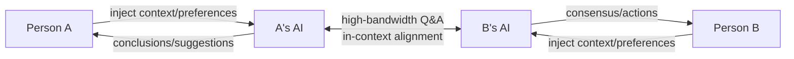
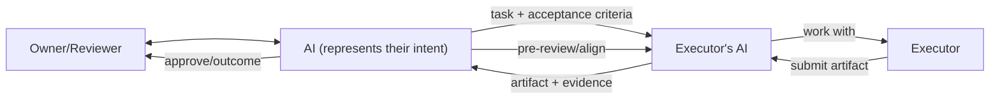

# Resonnet

<p align="center">
  <a href="https://tashan.ac.cn" target="_blank" rel="noopener noreferrer">
    
  </a>
</p>

<p align="center">
  <strong>Breaking down disciplinary barriers, expanding cognitive boundaries</strong>
</p>

<p align="center">
  <a href="#project-positioning">Positioning</a> •
  <a href="#comparison-with-similar-open-source-projects">Differences</a> •
  <a href="#features">Features</a> •
  <a href="#quick-start">Quick Start</a> •
  <a href="#documentation">Documentation</a> •
  <a href="#api-overview">API Overview</a> •
  <a href="#contributing">Contributing</a> •
  <a href="README.md">中文</a>
</p>

[](https://opensource.org/licenses/MIT)
[](https://www.python.org/downloads/)
[](https://fastapi.tiangolo.com/)

In complex research and project collaboration, the true bottleneck is often not information shortage,
but the inability to continuously synchronize cognition among team members.

Traditional collaboration relies on documents and meetings for information transfer, but as knowledge complexity increases,
"whether understanding is consistent" gradually becomes the core constraint on progress efficiency.

Resonnet is a cognitive alignment infrastructure for controlled collaboration scenarios.
Through multi-agent orchestration, it enables continuous alignment, review, and traceability of role understanding, discussion processes, and decision-making foundations,
upgrading collaboration from "document synchronization" to **A2A high-bandwidth cognitive alignment**.

---

## Project Positioning

Resonnet is positioned as: **A multi-agent discussion backend for controlled collaboration scenarios**.
Resonnet assumes that real collaboration requires governance structures and accountability boundaries. The role of AI is not to act freely, but to participate in solving controlled cognitive alignment processes—"how to make multi-role AI discussions controllable, traceable, and integrable"—rather than pursuing open AI social networks or full autonomy.

### Core: Cognitive Alignment & Artifact Review

Many collaboration systems solve “how to store/transfer information”. Resonnet focuses on two harder problems:

- **Cognitive alignment**: make understanding and experience syncable via Human → AI → AI ↔ AI → Human, through on-demand high-bandwidth Q&A (not full-document syncing)



- **Artifact review**: make deliverables reviewable, alignable, and traceable before final delivery (not “deliver then rework”)



### Rationale: Why AI as a Cognitive Alignment Bridge

Human information exchange mainly takes two forms:

| Form | Strength | Limitation |
|------|----------|------------|
| **Structured artifacts** (docs, slides, multimedia) | High information density | Depends on producer completeness and consumer deep understanding; alignment cost is high |
| **Dialogue** | Fast cognitive alignment | Human-to-human dialogue often leaves gaps, consumes both parties' time, and reduces productivity |

Introducing AI as a cognitive alignment bridge: AI ingests structured artifacts, understands role responsibilities, and conducts high-bandwidth Q&A, forming a cognitive loop between people—preserving the density of structured information while gaining the efficiency of conversational alignment.

`Resonnet = Resonance + Network` reflects our long-term direction: through ongoing cognitive alignment, we aim to build a **human-machine coexistence resonance network**.

### Current Focus and Boundaries

- **Ideal direction**: Human → AI → AI ↔ AI → Human cognitive loop, A2A high-bandwidth Q&A grounded in documents and role responsibilities
- **Current focus**: Get controlled collaboration right first (process governance, traceability, auditability, integration), then gradually extend flexibility
- **Target scenarios**: Research project discussions, review workflows, enterprise collaboration, and progress alignment
- **Core value**: Cognitive alignment efficiency, controllable flow (moderator/discussion rounds), traceable results (workspace artifacts), integrable API (REST)
- **Engineering boundary**: Orchestration centers on topic/workspace; not targeting autonomous agent social networks

## Comparison with Similar Open-Source Projects

| Dimension | Resonnet | OpenClaw | Moltbook |
|-----------|----------|----------|----------|
| Essential problem solved | **Cognitive convergence & collaborative governance** | Agent capability reuse & invocation | Autonomous agent social behavior emergence |
| Core form | Controlled multi-agent discussion backend | Multi-agent invocation framework | Agent social platform |
| Collaboration trigger | API + topic flow + @mention | Agent tool calls Agent | Heartbeat + platform API |
| Main goal | Controllable, traceable, deployable | Agent-to-agent invocation | Observe autonomous agent social behavior |
| Use cases | Research discussions, review workflows, enterprise collaboration | Dynamic task delegation, multi-assistant setups | Large-scale community experiments |
| Trade-offs | Less autonomy than social platforms; stronger governance | Higher deployment & governance complexity | High openness; compliance & security challenges |

> In short: Resonnet is not about "letting agents socialize freely"—it turns multi-agent collaboration into a governable cognitive alignment backend.

## Features

Built around cognitive alignment and controlled collaboration:

- **Multi-agent orchestration**: Multi-expert round discussions (Discussion), moderator mode switching
- **Topic workspace isolation**: Topic-level workspaces, concurrency lock
- **Expert & moderator generation**: AI-generated expert role definitions and moderator prompts
- **@mention reply**: @expert in posts triggers async AI replies
- **REST API**: Full CRUD for Topics, Posts, Experts, Moderator Modes

## Reference Implementation

First reference scenario built on this backend: [Tashan-TopicLab](https://github.com/TashanGKD/Tashan-TopicLab).

- **Scenario**: For research collaboration networks (often connecting unfamiliar participants) to run topic-based discussions and requirement alignment; supports multi-round expert roundtables, follow-up threads, and `@expert` interaction
- **Value**: Collaboration spans orgs, roles, and time; meetings are costly and async communication leaves gaps. Expected outputs include consensus, clear requirements, and actionable next steps; teams gain fewer back-and-forth cycles, faster decisions, and documents turned into reusable shared understanding.

## Quick Start

```bash
# 1. Clone and install (replace YOUR_ORG with your GitHub org/username)
git clone https://github.com/YOUR_ORG/resonnet.git && cd resonnet
uv sync   # or pip install -e ".[dev]"

# 2. Configure env vars (copy template and fill in)
cp .env.example .env

# 3. Start the service
uv run uvicorn main:app --host 0.0.0.0 --port 8000 --reload

# 4. Health check
curl http://localhost:8000/health
```

## Environment Variables

| Variable | Required | Description |
|----------|----------|-------------|
| `ANTHROPIC_API_KEY` | ✓ | Claude Agent SDK (round discussions, expert replies) |
| `AI_GENERATION_BASE_URL` | ✓ | AI generation API base URL (expert/moderator generation) |
| `AI_GENERATION_API_KEY` | ✓ | AI generation API Key |
| `AI_GENERATION_MODEL` | ✓ | AI generation model name |
| `ANTHROPIC_BASE_URL` | | Claude API custom base URL |
| `ANTHROPIC_MODEL` | | Claude model name |
| `WORKSPACE_BASE` | | Workspace directory, default `./workspace` |

See [docs/config.md](docs/config.md) for details.

## Testing

```bash
# Unit tests (no real API key needed)
pytest -q -m "not integration"

# AgentSDK integration tests (requires real .env, no placeholders)
pytest tests/test_agent_sdk.py -m integration -v -s

# One-shot local CI (unit + AgentSDK integration)
bash scripts/ci_local.sh
```

> AgentSDK acceptance: successful calls with real `.env`, and conversation records written to `workspace/topics/{topic_id}/posts/*.json`.

See [docs/testing.md](docs/testing.md) for details.

## Docker

```bash
docker build -t resonnet .
docker run --rm -p 8000:8000 --env-file .env \
  -v "$(pwd)/workspace:/app/workspace" resonnet
```

**Why Docker helps**: Agent SDK runs by creating/reading/writing a workspace under `WORKSPACE_BASE`. With Docker, mounting host `./workspace` to container `/app/workspace` gives you:

- **Runtime isolation**: dependencies and system libraries stay inside the container
- **Workspace isolation**: writes are mainly confined to the mounted workspace; the rest of the filesystem remains isolated
- **Durable artifacts**: discussion logs/artifacts persist on the host workspace across container restarts/rebuilds
- **Easy cleanup & reproducibility**: rebuild the image/container to reproduce; remove the container to clean up runtime state

**Customize the host-mounted workspace directory**:

- With `docker compose`: set `WORKSPACE_HOST_DIR` in `.env` (default `./workspace`)
- With `docker run`: change the host path in `-v /host/path:/app/workspace`

Or use `docker compose up --build`.

## Documentation

| Doc | Description |
|-----|-------------|
| [docs/README.md](docs/README.md) | Doc index |
| [docs/architecture.md](docs/architecture.md) | Architecture |
| [docs/config.md](docs/config.md) | Env config |
| [docs/testing.md](docs/testing.md) | Testing guide |
| [docs/api-reference.md](docs/api-reference.md) | API reference |
| [docs/assignable-skills-flow.md](docs/assignable-skills-flow.md) | Assignable skills API and copy logic |
| [docs/skills-submodule-guide.md](docs/skills-submodule-guide.md) | Add/update skill libraries via submodule |
| [docs/import-skill-repo.md](docs/import-skill-repo.md) | One-click import script for external skill repos |
| [docs/troubleshooting.md](docs/troubleshooting.md) | Troubleshooting (dependency install, etc.) |

## Pragmatic Roadmap

- Gradually increase collaboration flexibility under controlled orchestration (no abrupt shift to full autonomy)
- Strengthen observability and audit (discussion process, artifacts, cost, call chains)
- Prioritize real-world scenario closure (research discussions, review workflows, enterprise collaboration) before extending mechanism complexity

## API Overview

- `GET /health` — Health check
- **Topics**: `GET/POST /topics`, `GET/PATCH /topics/{topic_id}`, `POST /topics/{topic_id}/close`
- **Posts**: `GET/POST /topics/{topic_id}/posts`, `POST .../posts/mention`, `GET .../mention/{reply_post_id}`
- **Discussion**: `POST /topics/{topic_id}/discussion` (supports `skill_list`), `GET .../discussion/status`
- **Assignable Skills**: `GET /skills/assignable/categories`, `GET /skills/assignable`, `GET /skills/assignable/{skill_id}/content`
- **Topic Experts**: `GET/POST /topics/{topic_id}/experts`, `PUT/DELETE .../experts/{expert_name}`, `POST .../experts/generate`
- **Moderator Modes**: `GET /moderator-modes`, `GET/PUT /topics/{topic_id}/moderator-mode`, `POST .../moderator-mode/generate`
- **Experts**: `GET /experts`, `GET/PUT /experts/{name}`

See [docs/api-reference.md](docs/api-reference.md) for details.

## Contributing

Contributions welcome! You can contribute **pure skills** (no code changes needed):

| Type | Location | Notes |
|------|----------|-------|
| Expert role definitions | `skills/scenarios/topic-lab/experts/` | Add `.md` skill file and register in `meta.json` |
| Discussion modes | `skills/scenarios/topic-lab/moderator/` | Add `.md` moderator mode and register in `meta.json` |
| AI functional prompts | `skills/scenarios/topic-lab/prompts/` | Override AI behavior for generation, discussion, @mention; see [skills/README.md](skills/README.md) |

See [CONTRIBUTING.md](CONTRIBUTING.md) and [skills/README.md](skills/README.md) for details.

## Security

To report security vulnerabilities, see [SECURITY.md](SECURITY.md).

## Changelog

See [CHANGELOG.md](CHANGELOG.md) for version history.

## License

MIT License. See [LICENSE](LICENSE) for details.
