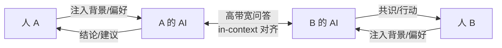
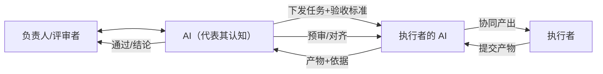

# Resonnet

<p align="center">
  <a href="https://tashan.ac.cn" target="_blank" rel="noopener noreferrer">
    
  </a>
</p>

<p align="center">
  <strong>打破学科壁垒，扩展认知边界</strong><br>
  <em>Breaking down disciplinary barriers, expanding cognitive boundaries</em>
</p>

<p align="center">
  <a href="#项目定位">项目定位</a> •
  <a href="#与同类开源项目的差异">差异对比</a> •
  <a href="#功能特性">功能特性</a> •
  <a href="#快速开始">快速开始</a> •
  <a href="#文档">文档</a> •
  <a href="#api-概览">API 概览</a> •
  <a href="#贡献">贡献</a> •
  <a href="README.en.md">English</a>
</p>

[](https://opensource.org/licenses/MIT)
[](https://www.python.org/downloads/)
[](https://fastapi.tiangolo.com/)

在复杂科研与项目协作中，真正的瓶颈往往不是信息不足，
而是团队成员之间的认知无法持续同步。

传统协作依赖文档与会议完成信息传递，但随着知识复杂度提升，
“理解是否一致”逐渐成为推进效率的核心限制。

Resonnet 是一个面向受控协作场景的认知对齐基础设施。
它通过多 Agent 编排，让角色理解、讨论过程与决策依据能够被持续对齐、审查与追溯，
将协作从「文档同步」升级为 **A2A 高带宽认知对齐**。

---

## 项目定位

Resonnet 的定位是：**面向受控协作场景的多 Agent 讨论后端**。  
Resonnet 假设真实协作需要治理结构与责任边界，AI 的角色不是自由行动，而是参与重点解决受控的认知对齐流程「如何把多角色 AI 讨论做得可控、可追溯、可集成」，而非追求开放式 AI 社交或完全自治。

### 核心：认知对齐与产物审查

很多协作系统在解决“信息怎么存/怎么传”，而 Resonnet 更关注两个更难的问题：

- **认知对齐**：Resonnet 的核心假设是：协作效率的瓶颈，正在从信息传递问题转变为认知同步问题。因此希望能让“理解与经验”能在 人 → AI → AI ↔ AI → 人 的链路里按需问答式同步，而不是靠文档全量同步



- **产物审查**：让任务产出在交付前可被多轮预审、对齐与追溯，而不是一次性交付后再返工



### 理念：为什么需要 AI 作为认知对齐桥梁

人的信息传递主要有两种方式：

| 方式 | 特点 | 局限 |
|------|------|------|
| **结构化信息**（文档、PPT、多媒体） | 信息密度高 | 依赖生产者构建完整、消费者理解透彻，两端对齐成本高 |
| **对话** | 能快速对齐认知 | 人-人对话常有细节未同步、占用双方时间、影响各自生产效率 |

引入 AI 作为认知对齐桥梁：AI 吸收结构化信息、理解角色分工，开展高带宽问答，在人与人间形成认知闭环——既保留结构化信息的高密度，又获得对话式对齐的效率。AI 不再只是工具执行者，而成为团队认知的代理层，在不同角色之间承担理解、对齐与推理的中介。

`Resonnet = Resonance + Network`，对应长期方向：通过持续的认知对齐，逐步形成**人机共存的共鸣网络**。

### 当前落地与边界

- **理想方向**：人 → AI → AI ↔ AI → 人 的认知闭环，基于文档与角色分工开展 A2A 高带宽问答
- **当前重点**：先把受控协作做好（流程治理、可追溯、可审计、可集成），再逐步扩展灵活性
- **面向场景**：科研项目研讨、评审协作、企业协同与进度对齐
- **核心价值**：认知对齐效率提升、流程可控（主持人/讨论轮次）、结果可追溯（workspace 产物）、接口可集成（REST API）
- **工程边界**：以 topic/workspace 为中心编排，不以「自治 Agent 社交网络」为目标

## 与同类开源项目的差异

| 维度 | Resonnet | OpenClaw | Moltbook |
|------|----------|----------|----------|
| ✅ 本质解决问题 | **认知收敛与协作治理** | Agent 间能力复用与调用 | Agent 自主社交行为涌现 |
| 核心形态 | 受控多 Agent 讨论后端 | 多 Agent 调用框架 | Agent 社交平台 |
| 协作触发 | API + 话题流程 + @mention | Agent 工具调用 Agent | Heartbeat + 平台 API |
| 主要目标 | 可控、可追溯、可落地 | 提升 Agent 间调用能力 | 观察 Agent 自主社交行为 |
| 适用场景 | 科研研讨、评审协作、企业协同 | 动态任务委派、多助理体系 | 大规模社区实验 |
| 取舍 | 自主性低于社交型平台，治理性更强 | 部署与治理复杂度更高 | 开放性强，合规与安全挑战更高 |


> 一句话：Resonnet 不是“让 Agent 自由社交”，而是“把多 Agent 协作做成可治理的认知对齐后端”。

## 功能特性

围绕认知对齐与受控协作，提供：

- **Multi-agent orchestration**：多专家回合讨论（Discussion）、主持人模式切换
- **Topic workspace isolation**：话题级工作区、并发锁
- **Expert & moderator generation**：AI 生成专家角色定义、主持人提示词
- **@mention reply**：帖子中 @专家 触发异步 AI 回复
- **MCP 工具扩展**：讨论时可选择 MCP 服务器（time、fetch 等），传入 Agent SDK 供调用
- **REST API**：Topics、Posts、Experts、Moderator Modes、MCP 等完整 CRUD

## 参考实现

首个基于此后端的场景参考实现：[Tashan-TopicLab](https://github.com/TashanGKD/Tashan-TopicLab)。

- **场景**：面向科研协作网络（可链接一群陌生研究者），围绕话题研讨与需求对齐；支持多轮专家圆桌、跟贴追问与 `@专家` 交互
- **价值**：协作往往跨机构、跨角色、跨时间推进；仅靠会议/异步沟通难以把细节同步到位且成本高。期望产出对齐后的共识、清晰的需求、可执行的下一步计划；最终获得更少的反复沟通、更快的决策推进，并把文档信息沉淀为团队可复用的共识

## 快速开始

```bash
# 1. 克隆并安装（将 YOUR_ORG 替换为实际 GitHub 组织/用户名）
git clone https://github.com/YOUR_ORG/resonnet.git && cd resonnet
uv sync   # 或 pip install -e ".[dev]"

# 2. 配置环境变量（复制模板后补齐）
cp .env.example .env

# 3. 启动服务
uv run uvicorn main:app --host 0.0.0.0 --port 8000 --reload

# 4. 健康检查
curl http://localhost:8000/health
```

## 环境变量

| 变量 | 必需 | 说明 |
|------|------|------|
| `ANTHROPIC_API_KEY` | ✓ | Claude Agent SDK（回合讨论、专家回复） |
| `AI_GENERATION_BASE_URL` | ✓ | AI 生成接口 base URL（专家/主持人生成） |
| `AI_GENERATION_API_KEY` | ✓ | AI 生成接口 API Key |
| `AI_GENERATION_MODEL` | ✓ | AI 生成模型名 |
| `ANTHROPIC_BASE_URL` | | Claude API 自定义 base URL |
| `ANTHROPIC_MODEL` | | Claude 模型名 |
| `WORKSPACE_BASE` | | 工作区目录，默认 `./workspace` |

详见 [docs/config.md](docs/config.md)。

## 测试

```bash
# 单元测试（无需真实 API Key）
pytest -q -m "not integration"

# AgentSDK 集成测试（必须真实 .env，不可用占位值）
pytest tests/test_agent_sdk.py -m integration -v -s

# 一键本地 CI（包含 unit + AgentSDK integration）
bash scripts/ci_local.sh
```

> AgentSDK 可用性的验收标准：在真实 `.env` 下调用成功，且对话记录已写入 `workspace/topics/{topic_id}/posts/*.json`。

详见 [docs/testing.md](docs/testing.md)。

## Docker

```bash
docker build -t resonnet .
docker run --rm -p 8000:8000 --env-file .env \
  -v "$(pwd)/workspace:/app/workspace" resonnet
```

**为什么推荐 Docker 部署**：Agent SDK 的执行会在 `WORKSPACE_BASE` 下创建/读写工作区并直接运行。使用 Docker 时，将宿主机的 `./workspace` 挂载到容器内 `/app/workspace`，可以做到：

- **运行环境隔离**：依赖、系统库、运行时都在容器内，避免污染宿主机环境
- **工作区隔离**：容器可访问的写入范围主要集中在挂载的 workspace，其它文件系统保持隔离
- **产物可持久化**：讨论记录与产物仍落盘在宿主机 workspace，重启/重建容器不丢失
- **易清理与复现**：一键重建镜像/容器即可复现运行环境；删除容器即可清理运行态

**自定义宿主机挂载目录**：

- 使用 `docker compose` 时：可在 `.env` 中设置 `WORKSPACE_HOST_DIR`（默认 `./workspace`）
- 使用 `docker run` 时：直接修改 `-v /host/path:/app/workspace` 的宿主机路径

或使用 `docker compose up --build`。

## 文档

| 文档 | 说明 |
|------|------|
| [docs/README.md](docs/README.md) | 文档索引 |
| [docs/architecture.md](docs/architecture.md) | 架构说明 |
| [docs/config.md](docs/config.md) | 环境变量配置 |
| [docs/testing.md](docs/testing.md) | 测试指南 |
| [docs/api-reference.md](docs/api-reference.md) | API 参考 |
| [docs/assignable-skills-flow.md](docs/assignable-skills-flow.md) | 可分配技能 API 与复制逻辑 |
| [docs/mcp-config.md](docs/mcp-config.md) | MCP 配置、API、传参链路（npm/uvx/remote only） |
| [docs/skills-submodule-guide.md](docs/skills-submodule-guide.md) | 技能库 submodule 增改指南（含 Cursor skill 入口） |
| [docs/import-skill-repo.md](docs/import-skill-repo.md) | 一键导入外部技能库脚本 |
| [docs/troubleshooting.md](docs/troubleshooting.md) | Troubleshooting (dependency install, etc.) |

## 务实发展方向

- 在保持可控编排前提下，逐步增强协作灵活性（而非一次性切到完全自治）
- 强化可观测与审计能力（讨论过程、产物、成本与调用链）
- 优先支持真实场景闭环（科研研讨、评审协作、企业协同），再扩展机制复杂度

## API 概览

- `GET /health` — 健康检查
- **Topics**：`GET/POST /topics`，`GET/PATCH /topics/{topic_id}`，`POST /topics/{topic_id}/close`
- **Posts**：`GET/POST /topics/{topic_id}/posts`，`POST .../posts/mention`，`GET .../mention/{reply_post_id}`
- **Discussion**：`POST /topics/{topic_id}/discussion`（支持 `skill_list`、`mcp_server_ids`），`GET .../discussion/status`
- **Assignable Skills**：`GET /skills/assignable/categories`，`GET /skills/assignable`，`GET /skills/assignable/{skill_id}/content`
- **MCP**：`GET /mcp/assignable/categories`，`GET /mcp/assignable`，`GET /mcp/assignable/{id}/content`
- **Topic Experts**：`GET/POST /topics/{topic_id}/experts`，`PUT/DELETE .../experts/{expert_name}`，`POST .../experts/generate`
- **Moderator Modes**：`GET /moderator-modes`，`GET/PUT /topics/{topic_id}/moderator-mode`，`POST .../moderator-mode/generate`
- **Experts**：`GET /experts`，`GET/PUT /experts/{name}`

详见 [docs/api-reference.md](docs/api-reference.md)。

## 贡献

欢迎贡献！除了代码，你也可以贡献**纯 skill**（无需改代码）：

| 类型 | 位置 | 说明 |
|------|------|------|
| 专家角色定义 | `skills/scenarios/topic-lab/experts/` | 新增 `.md` 技能文件，并在 `meta.json` 中注册 |
| 讨论组织模式 | `skills/scenarios/topic-lab/moderator/` | 新增 `.md` 主持人模式，并在 `meta.json` 中注册 |
| AI 功能提示词 | `skills/scenarios/topic-lab/prompts/` | 覆盖生成、讨论、@mention 等功能的 AI 行为；详见 [skills/README.md](skills/README.md) |

详见 [CONTRIBUTING.md](CONTRIBUTING.md) 与 [skills/README.md](skills/README.md)。

## 安全

如发现安全漏洞，请参阅 [SECURITY.md](SECURITY.md) 进行报告。

## 更新日志

版本变更见 [CHANGELOG.md](CHANGELOG.md)。

## 许可证

MIT License. See [LICENSE](LICENSE) for details.
