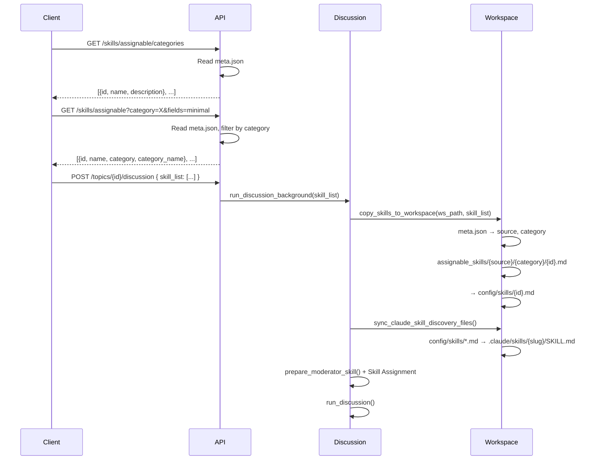
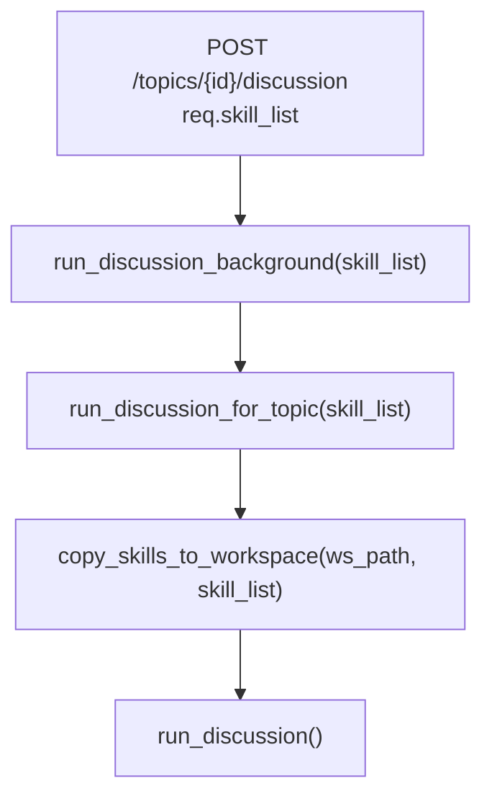
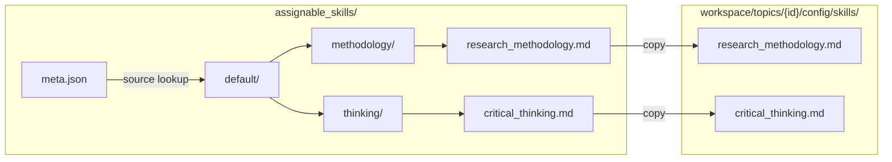
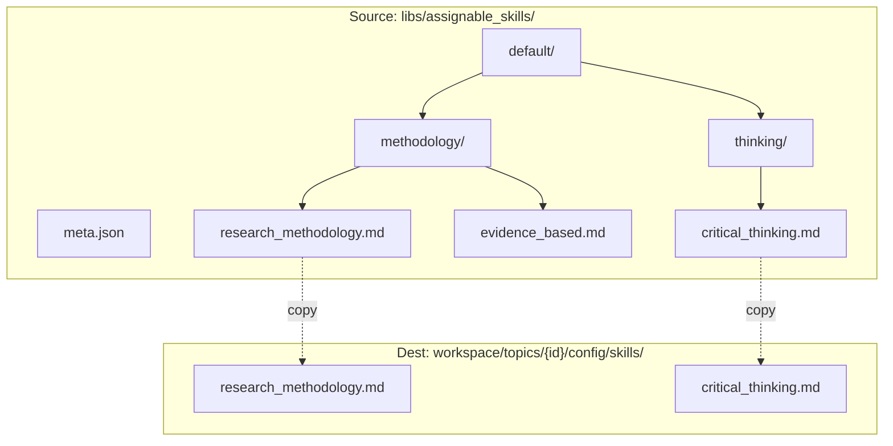
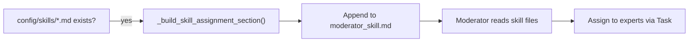

# Assignable Skills Flow (Backend)

> How the backend provides the skills library API, receives `skill_list`, and copies skills to the topic workspace.

**Related docs**:

- [docs/ASSIGNABLE_SKILLS_FLOW.md](../../docs/ASSIGNABLE_SKILLS_FLOW.md) — Frontend flow (agent-topic-lab)
- [docs/ASSIGNABLE_SKILLS_CHANGELOG.md](../../docs/ASSIGNABLE_SKILLS_CHANGELOG.md) — Full change summary (agent-topic-lab)
- [import-skill-repo.md](import-skill-repo.md) — Import script
- [skills-submodule-guide.md](skills-submodule-guide.md) — Points to `.cursor/skills/skills-submodule-guide/SKILL.md`

---

## Overview



---

## 1. API Implementation

### 1.1 GET /skills/assignable

- **Implementation**: `app/api/skills.py` → `list_assignable_skills()`
- **Data source**: Aggregated from `meta.json` (sources registry) + per-source `{source}/meta.json`
- **Response**: `[{ id, name, description?, category, category_name }, ...]`

**Query params** (all optional, for large skill libraries):

| Param | Type | Description |
|-------|------|-------------|
| `category` | string | Filter by category id |
| `fields` | string | `minimal` = id, name, category, category_name only (smaller payload) |
| `limit` | int | Max items to return |
| `offset` | int | Skip N items (pagination) |

### 1.2 GET /skills/assignable/categories

- **Implementation**: `app/api/skills.py` → `list_assignable_categories()`
- **Response**: `[{ id, name, description }, ...]`

### 1.3 GET /skills/assignable/{skill_id}/content

- **Implementation**: `app/api/skills.py` → `get_skill_content()`
- **Response**: `{ content: string }` — raw markdown content of the skill file

### 1.4 POST /topics/{topic_id}/discussion

- **Request body**: `StartDiscussionRequest` with `skill_list: list[str]` (default `[]`)
- **Forwarding**: `req.skill_list` → `run_discussion_background(skill_list=...)` → `run_discussion_for_topic(skill_list=...)`

---

## 2. Copy Logic

### 2.1 Call Chain



### 2.2 copy_skills_to_workspace



| Step | Description |
|------|-------------|
| 1 | Load aggregated meta (per-source `{source}/meta.json` with `skills_dir`), get `skills` (including `source`, `category`) |
| 2 | Parse `skill_id`: supports `source:slug` format to avoid collisions when importing multiple libraries |
| 3 | Source path: default = `{source}/{category}/{slug}.md`; imported = `_submodules/{source}/{skills_dir}/{category}/{slug}/SKILL.md` |
| 4 | Dest path: `config/skills/{slug}.md` or `{source}_{slug}.md` (to avoid name collisions) |
| 5 | Execute `Path.write_text(src.read_text())` copy |

**Implementation**: `app/agent/workspace.py` → `copy_skills_to_workspace()`

### 2.3 Claude Agent SDK Auto-Discovery Mirror

Before `run_discussion()` and `run_expert_reply()` start querying the SDK, backend mirrors topic workspace skills
to Claude Code's project skill directory:

- `config/skills/*.md` -> `.claude/skills/{slug}/SKILL.md`
- `config/moderator_skill.md` -> `.claude/skills/moderator_orchestrator/SKILL.md`

This enables SDK-level skill auto-discovery in addition to prompt-level assignment.
Both discussion and mention-reply flows set `ClaudeAgentOptions.setting_sources=["project", "local"]`
so project/local settings are loaded and discovered skills become available.

**Implementation**:

- `app/agent/workspace.py` -> `sync_claude_skill_discovery_files()`
- `app/agent/discussion.py` -> `run_discussion()` (calls sync + sets `setting_sources`)
- `app/agent/expert_reply.py` -> `run_expert_reply()` (calls sync + sets `setting_sources`)

### 2.4 Directory Structure



---

## 3. Moderator Skill Assignment



When `prepare_moderator_skill()` detects `.md` files under `config/skills/`, it appends a "Skill Assignment" section to the moderator skill, instructing the moderator to:

1. Use the Read tool to read `config/skills/*.md`
2. Choose appropriate skills per discussion phase and topic
3. Pass skill content as additional instructions when calling expert Tasks

**Implementation**: `app/agent/moderator_modes.py` → `_build_skill_assignment_section()`

---

## 4. Source-prefixed ID (Multi-library Import)

When importing many skill libraries, use `source:slug` format to avoid id collisions:

| Format | Example | Path |
|--------|---------|------|
| Built-in (default) | `research_methodology` | `default/{category}/{slug}.md` |
| Prefixed | `awesome:critical_thinking` | `awesome/{category}/{slug}.md` |

**meta example**:

```json
{
  "skills": {
    "research_methodology": { "source": "default", "category": "methodology", ... },
    "awesome:critical_thinking": { "source": "awesome", "category": "thinking", ... }
  }
}
```

**When importing**: Run `./scripts/import_skill_repo.sh <url> [source]`; the script writes `{source}/meta.json` and skills stay in `_submodules/{source}/{skills_dir}/...`. For manually added built-in skills, use `{source}:{slug}` as meta key and place files at `assignable_skills/{source}/{category}/{slug}.md`.

---

## 5. Quick Reference

| Item | Description |
|------|-------------|
| Directory structure | `assignable_skills/{source}/{category}/{slug}.md` |
| Built-in source | `default` |
| meta fields | `id`, `source`, `name`, `description`, `category` |
| API response | `id`, `source`, `name`, `description`, `category`, `category_name` (use `fields=minimal` to omit description, source) |
| Query params | `category`, `fields`, `limit`, `offset` for filtering and pagination |
| Discussion request | `skill_list: string[]` (list of skill ids) |
