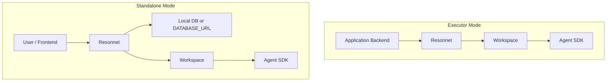

# Resonnet Runtime Modes

## Overview

Resonnet currently supports two runtime modes:

- `executor`: Resonnet acts as an Agent SDK execution backend for an upstream application backend such as `topiclab-backend`
- `standalone`: Resonnet runs as an independent MVP backend and owns its own topic business APIs

The mode is controlled by `RESONNET_MODE`.

```bash
RESONNET_MODE=executor
```

If `RESONNET_MODE` is omitted, the default is `executor`.

## Mode 1: Executor

Use this mode when another backend already owns the business source of truth.

Typical example:

- `topiclab-backend` owns `topics`, `posts`, `discussion status`, `experts`, and `moderator config`
- Resonnet only hydrates workspaces, runs the Agent SDK, and returns execution results

### Responsibilities

In `executor` mode, Resonnet is responsible for:

- Creating or hydrating `workspace/topics/{topic_id}`
- Running discussions and expert replies through the Agent SDK
- Writing runtime artifacts into the workspace:
  - `shared/turns/*.md`
  - `shared/discussion_summary.md`
  - `shared/generated_images/*`
- Returning structured execution results to the caller

In `executor` mode, Resonnet does not own:

- Topic CRUD
- Post CRUD
- Discussion business-state persistence
- The upstream business database

### Main APIs

These executor APIs are the primary integration surface:

- `POST /executor/topics/bootstrap`
- `POST /executor/discussions`
- `POST /executor/expert-replies`

Topic-scoped expert and moderator-mode endpoints can still be used to manage workspace-backed runtime configuration, but they are no longer the main business entry point.

### Environment

Minimum required environment is focused on execution:

- `RESONNET_MODE=executor`
- `ANTHROPIC_API_KEY`
- `AI_GENERATION_BASE_URL`
- `AI_GENERATION_API_KEY`
- `AI_GENERATION_MODEL`
- `WORKSPACE_BASE`

No topic business database is required in this mode.

### Example

```bash
RESONNET_MODE=executor \
WORKSPACE_BASE=./workspace \
uv run uvicorn main:app --host 0.0.0.0 --port 8000 --reload
```

## Mode 2: Standalone

Use this mode when Resonnet should run as an independent product MVP.

Typical example:

- Open-source demo deployment
- Local MVP validation
- A single service that owns both topic APIs and Agent SDK execution

### Responsibilities

In `standalone` mode, Resonnet is responsible for:

- Topic CRUD
- Post CRUD
- Discussion start and status APIs
- Topic expert and moderator-mode management
- Agent SDK execution
- Workspace artifact generation
- Its own persistence layer

### Main APIs

In addition to executor APIs, standalone mode exposes the topic business routes:

- `GET/POST /topics`
- `GET/PATCH /topics/{topic_id}`
- `POST /topics/{topic_id}/close`
- `GET/POST /topics/{topic_id}/posts`
- `POST /topics/{topic_id}/posts/mention`
- `GET /topics/{topic_id}/posts/mention/{reply_post_id}`
- `POST /topics/{topic_id}/discussion`
- `GET /topics/{topic_id}/discussion/status`

### Environment

Use:

- `RESONNET_MODE=standalone`
- the same Agent SDK variables as executor mode
- optionally `DATABASE_URL`

If `DATABASE_URL` is not provided in standalone mode, Resonnet falls back to a local SQLite file under:

```text
workspace/resonnet.sqlite3
```

### Example

```bash
RESONNET_MODE=standalone \
WORKSPACE_BASE=./workspace \
uv run uvicorn main:app --host 0.0.0.0 --port 8000 --reload
```

## Decision Guide

Use `executor` when:

- You already have an application backend
- You want non-AI business flows to stay outside Resonnet
- You want Resonnet to behave like an execution engine

Use `standalone` when:

- You want a self-contained MVP
- You want one service to expose both business APIs and execution
- You are evaluating Resonnet independently of TopicLab

## Request Boundary



## Notes

- `executor` is the default mode.
- Workspace artifacts remain important in both modes.
- In integrated deployments, the upstream backend should persist business truth; Resonnet should only persist runtime artifacts.
